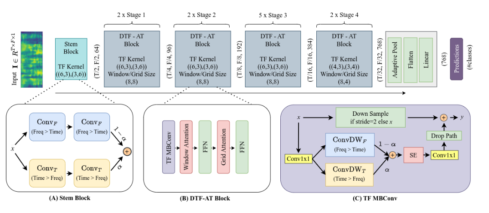
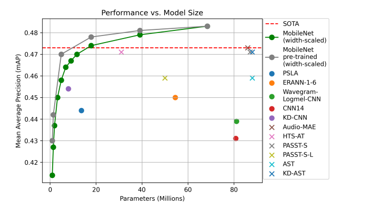

 [简体中文](./README.md)| [English](./README_en.md)

# 基于Pytorch的声音事件检测分类系统


# 1.简介
&emsp;&emsp;项目是基于Urbansound8K数据集提取MEl谱特征的Pytorch的声音分类项目，旨在实现对各种环境声音、动物叫声和语种的识别。项目提供了20多种声音分类模型，
涉及CNN和Transformer等结构的不同参数大小的模型，如EcapaTdnn、PANNS（CNN6)、TDNN、PANNS（CNN14)、PANNS（CNN10)、DTFAT(MaxAST)、EAT-M-Transformer、AST、TDNN_GRU_SE、mn10_as、dymn10_as、ERes2NetV2、ResNetSE_GRU、ResNetSE、CAMPPlus、HTS-AT、EffilecentNet_B2、ERes2Net、Res2Net和MobileNetV4  ，以支持不同的应用场景。此外，项目还提供了常用的Urbansound8K数据集测试报告和使用例子。用户可以根据自己的需求选择适合的模型和数据集，以实现更准确的声音分类。项目的应用场景广泛，可以用于室外的环境监测、野生动物保护、语音识别等领域。同时，项目也鼓励用户探索更多的使用场景，以推动声音分类技术的发展和应用。
项目的主要架构为：

# 2.数据集介绍
&emsp;&emsp;[探索城市声音的奥秘：UrbanSound8K数据集推荐](https://blog.csdn.net/gitblog_09756/article/details/143284996)

&emsp;&emsp;数据集（Urbansound8K） 是目前应用较为广泛的用于自动城市环境声分类研究的公共数据集，包含10个分类：空调声、汽车鸣笛声、儿童玩耍声、狗叫声、钻孔声、引擎空转声、枪声、手提钻、警笛声和街道音乐声。
本数据集可以用于声音分类相关的项目，使用本数据集实现对语音分类方面项目的熟悉与掌握，对数据集的介绍和项目的评估如下：

&emsp;&emsp;自动城市环境声分类:本数据集中的数据在audio文件夹中，其中fold1到fold10中为十种常见声音。
UrbanSound8K.csv：此文件包含数据集中每个音频文件的元数据信息
其余具体属性可查看UrbanSound8K_README.txt进行了解。

&emsp;&emsp;数据集下载地址1：[UrbanSound8K.tar.gz](https://aistudio.baidu.com/aistudio/datasetdetail/36625)  
&emsp;&emsp;数据集下载地址2：[UrbanSound8K.tar.gz](https://openxlab.org.cn/datasets/OpenDataLab/UrbanSound8K)  
&emsp;&emsp;目录如下：
```
└── UrbanSound8K  
├── audio  
│   ├── fold1  
│   ├── fold10  
│   ├── fold2  
│   ├── fold3  
│   ├── fold4  
│   ├── fold5  
│   ├── fold6  
│   ├── fold7  
│   ├── fold8  
│   └── fold9  
├── FREESOUNDCREDITS.txt
├── metadata
│   └── UrbanSound8K.csv
└── UrbanSound8K_README.txt
```
# 3.环境准备
```commandline
conda create --name AudioClassification-mini  python=3.12
pip install -r requirements.txt
```
# 4.模型库
### 项目特性

1. 支持模型：EcapaTdnn、PANNS（CNN6)、TDNN、PANNS（CNN14)、PANNS（CNN10)、DTFAT(MaxAST)、EAT-M-Transformer、AST、TDNN_GRU_SE、mn10_as、dymn10_as、ERes2NetV2、ResNetSE_GRU、ResNetSE、CAMPPlus、HTS-AT、EffilecentNet_B2、ERes2Net、Res2Net、MobileNetV4
2. 支持池化层：AttentiveStatsPool(ASP)、SelfAttentivePooling(SAP)、TemporalStatisticsPooling(TSP)、TemporalAveragePooling(TAP)
3. 特征提取方式：MelSpectrogram，以[1,64,100]或者[1,64,128]进行特征提取


**模型源码：**
- AudioClassification-Pytorch: [https://github.com/yeyupiaoling/AudioClassification-Pytorch](https://github.com/yeyupiaoling/AudioClassification-Pytorch)

- PSLA(EfficentNet):[https://github.com/YuanGongND/psla/blob/main/src/models/Models.py](https://github.com/YuanGongND/psla/blob/main/src/models/Models.py)  

- MobleNetv4:[https://github.com/d-li14/mobilenetv4.pytorch](https://github.com/d-li14/mobilenetv4.pytorch)

- DTFAT:[https://github.com/ta012/DTFAT](https://github.com/ta012/DTFAT)
-  
- AST:[https://github.com/YuanGongND/ast/blob/master/src/models/ast_models.py](https://github.com/YuanGongND/ast/blob/master/src/models/ast_models.py)

- HTS-AT:[https://github.com/retrocirce/hts-audio-transformer](https://github.com/retrocirce/hts-audio-transformer)

- Efficientat:[https://github.com/fschmid56/efficientat](https://github.com/fschmid56/efficientat)

- Max-AST:[https://github.com/ta012/MaxAST](https://github.com/ta012/MaxAST)

- EAT:[https://github.com/Alibaba-MIIL/AudioClassfication](https://github.com/Alibaba-MIIL/AudioClassfication)

# 模型测试表

|      模型网络结构       | batch_size |  FLOPs(G)   | Params(M) | 特征提取方式 |       数据集        | 类别数量 |                                    模型验证集性能                                    |
|:-----------------:|------------|:-----------:|:---------:|:------:|:----------------:|:----:|:-----------------------------------------------------------------------------:|
|     EcapaTdnn     | 128        |    0.48     |    6.1    |  mel   |   UrbanSound8K   |  10  |       accuracy=0.974, precision=0.972<br/> recall=0.967, F1-score=0.967       |
|    PANNS（CNN6)    | 128        |    0.98     |   4.57    |  mel   |   UrbanSound8K   |  10  |       accuracy=0.971, precision=0.963<br/> recall=0.954, F1-score=0.955       |
|       TDNN        | 128        |    0.21     |   2.60    |  mel   |   UrbanSound8K   |  10  |       accuracy=0.968, precision=0.964<br/>recall=0.959, F1-score=0.958        |
|   PANNS（CNN14)    | 128        |    1.98     |   79.7    |  mel   |   UrbanSound8K   |  10  |       accuracy=0.966, precision=0.956<br/>recall=0.957, F1-score=0.952        |
|   PANNS（CNN10)    | 128        |    1.29     |   4.96    |  mel   |   UrbanSound8K   |  10  |       accuracy=0.964, precision=0.955<br/> recall=0.955, F1-score=0.95        |
|   DTFAT(MaxAST)   | 16         |    8.32     |   68.32   |  mel   |   UrbanSound8K   |  10  |       accuracy=0.963, precision=0.939<br/> recall=0.935, F1-score=0.933       |
| EAT-M-Transformer | 128        |    0.16    |   1.59    |  mel   |   UrbanSound8K   |  10  |        accuracy=0.935, precision=0.905<br/> recall=0.907, F1-score=0.9        |
|        AST        | 16         |    5.28     |   85.26   |  mel   |   UrbanSound8K   |  10  |       accuracy=0.932, precision=0.893<br/>recall=0.887, F1-score=0.884        |
|    TDNN_GRU_SE    | 256        |    0.26     |   3.02    |  mel   |   UrbanSound8K   |  10  |       accuracy=0.929, precision=0.916<br/> recall=0.907, F1-score=0.904       |
|      mn10_as      | 128        |    0.03    |   4.21    |  mel   |   UrbanSound8K   |  10  |       accuracy=0.912, precision=0.88<br/> recall=0.894, F1-score=0.878        |
|     dymn10_as     | 128        |    0.01    |   4.76    |  mel   |   UrbanSound8K   |  10  |       accuracy=0.904, precision=0.886<br/> recall=0.883, F1-score=0.872       |
|    ERes2NetV2     | 128        |    0.87     |   5.07    |  mel   |   UrbanSound8K   |  10  |       accuracy=0.874, precision=0.828<br/>recall=0.832, F1-score=0.818        |
|   ResNetSE_GRU    | 128        |    1.84     |   10.31   |  mel   |   UrbanSound8K   |  10  |       accuracy=0.865, precision=0.824<br/>recall=0.827, F1-score=0.813        |
|     ResNetSE      | 128        |    1.51     |   7.15    |  mel   |   UrbanSound8K   |  10  |       accuracy=0.859, precision=0.82<br/> recall=0.819, F1-score=0.807        |
|     CAMPPlus      | 128        |    0.47     |   7.30    |  mel   |   UrbanSound8K   |  10  |       accuracy=0.842, precision=0.793<br/>recall=0.788, F1-score=0.778        |
|      HTS-AT       | 16         |    5.70    |   27.59   |  mel   |   UrbanSound8K   |  10  |          accuracy=0.84, precision=0.802<br/> recall=0.796, F1-score=0.795          |
| EffilecentNet_B2  | 128        |     --      |   7.73    |  mel   |   UrbanSound8K   |  10  |       accuracy=0.779, precision=0.718<br/> recall=0.741, F1-score=0.712       |
|     ERes2Net      | 128        |    1.39     |   6.22    |  mel   |   UrbanSound8K   |  10  |       accuracy=0.778, precision=0.808<br/> recall=0.787, F1-score=0.779       |
|      Res2Net      | 128        |    0.04     |   5.09    |  mel   |   UrbanSound8K   |  10  |       accuracy=0.723, precision=0.669<br/>recall=0.672, F1-score=0.648        |
|    MobileNetV4    | 128        |    0.03     |   2.51    |  mel   | UrbanSound8K     |  10  |       accuracy=0.608, precision=0.553<br/>recall=0.549, F1-score=0.523        |
### 说明：

&emsp;&emsp;使用的测试集为从数据集中每10条音频取一条，共874条。

# 5.准备数据

&emsp;&emsp;生成数据集的list,label_list.txt,train_list.txt,test_list.txt
执行`create_data.py`即可生成数据列表，里面提供了生成多种数据集列表方式，具体看代码。
```shell
python create_data.py
```

&emsp;&emsp;生成的列表是长这样的，前面是音频的路径，后面是该音频对应的标签，从0开始，路径和标签之间用`\t`隔开。
```shell
dataset/UrbanSound8K/audio/fold2/104817-4-0-2.wav	4
dataset/UrbanSound8K/audio/fold9/105029-7-2-5.wav	7
dataset/UrbanSound8K/audio/fold3/107228-5-0-0.wav	5
dataset/UrbanSound8K/audio/fold4/109711-3-2-4.wav	3
```
# 5.特征提取（可选，如果进行特征提取，训练耗时提升36倍）,已提取的特征文件和已训练的模型文件下载。模型放到model目录下，特征放到features目录下。
链接: https://pan.baidu.com/s/15ziJovO3t41Nqgqtmovuew 提取码: 8a59 

```shell
python extract_feature.py
```
# 6.训练,可以通过指定--model_type的参数来指定模型，进行模型训练。如：EcapaTdnn、PANNS（CNN6)、TDNN、PANNS（CNN14)、PANNS（CNN10)、DTFAT(MaxAST)、EAT-M-Transformer、AST、TDNN_GRU_SE、mn10_as、dymn10_as、ERes2NetV2、ResNetSE_GRU、ResNetSE、CAMPPlus、HTS-AT、EffilecentNet_B2、ERes2Net、Res2Net、MobileNetV4  
```shell
python train.py --model_type EAT-M-Transformer
```
&emsp;&emsp;在线提取特征训练的日志为： 
```commandline
Epoch: 10
Train: 100%|██████████| 62/62 [07:28<00:00,  7.23s/it, BCELoss=0.931, accuracy=0.502, precision=0.563, recall=0.508, F1-score=0.505]
Valid: 100%|██████████| 14/14 [00:53<00:00,  3.82s/it, BCELoss=1.19, accuracy=0.425, precision=0.43, recall=0.393, F1-score=0.362]

Epoch: 11
Train: 100%|██████████| 62/62 [07:23<00:00,  7.16s/it, BCELoss=2.17, accuracy=0.377, precision=0.472, recall=0.386, F1-score=0.375]
Valid: 100%|██████████| 14/14 [00:48<00:00,  3.47s/it, BCELoss=2.7, accuracy=0.362, precision=0.341, recall=0.328, F1-score=0.295]

Epoch: 12
Train: 100%|██████████| 62/62 [07:20<00:00,  7.11s/it, BCELoss=1.8, accuracy=0.297, precision=0.375, recall=0.308, F1-score=0.274]
Valid: 100%|██████████| 14/14 [00:48<00:00,  3.47s/it, BCELoss=1.08, accuracy=0.287, precision=0.317, recall=0.285, F1-score=0.234]
```
&emsp;&emsp;离线提取特征训练的日志为： 
```commandline
Epoch: 1
Train: 100%|██████████| 62/62 [00:12<00:00,  4.77it/s, BCELoss=8.25, accuracy=0.0935, precision=0.0982, recall=0.0878, F1-score=0.0741]
Valid: 100%|██████████| 14/14 [00:00<00:00, 29.53it/s, BCELoss=5.98, accuracy=0.142, precision=0.108, recall=0.129, F1-score=0.0909]
Model saved in the folder :  model
Model name is :  SAR_Pesudo_ResNetSE_s0_BCELoss

Epoch: 2
Train: 100%|██████████| 62/62 [00:12<00:00,  4.93it/s, BCELoss=7.71, accuracy=0.117, precision=0.144, recall=0.113, F1-score=0.0995]
Valid: 100%|██████████| 14/14 [00:00<00:00, 34.54it/s, BCELoss=8.15, accuracy=0.141, precision=0.0811, recall=0.133, F1-score=0.0785]
```
# 7.测试
 &emsp;&emsp;测试采用流式测试的方式，即每次送入模型2秒的音频数据，将音频数据转为[1,1,64,100]维度的张量数据，然后送入到模型中进行推理，每次都很得到推理的结构，可以根据阈值来判断该事件是否发生。
```shell
python model_test.py --model_type EAT-M-Transformer
```