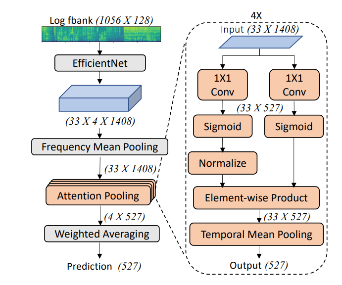
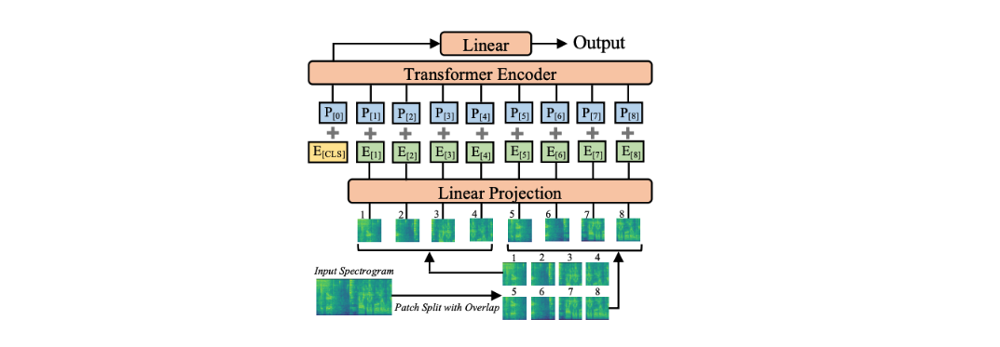
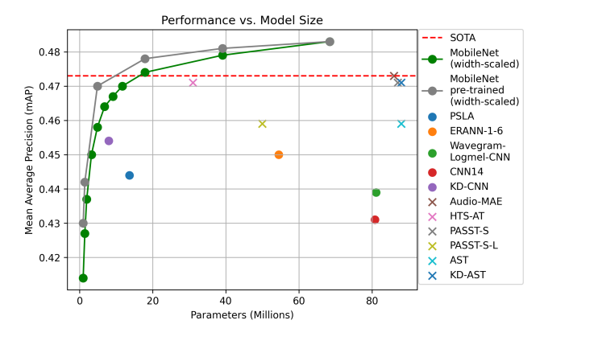

简体中文 | [English](./README_en.md)

# Pytorch based sound event detection and classification system


# 1.introduction
&emsp;&emsp;The project is a sound classification project based on the Urbansound8K dataset Extracting MEL spectral features Pytorch, aimed at recognizing various environmental sounds, animal calls, and languages. The project provides over 20 sound classification models,
Models with different parameter sizes involving structures such as CNN and Transformer, such as EcapaTdnn PANNS（CNN6)、TDNN、PANNS（CNN14)、PANNS（CNN10)、DTFAT(MaxAST)、EAT-M-Transformer、AST、TDNN_GRU_SE、mn10_as、dymn10_as、ERes2NetV2、ResNetSE_GRU、ResNetSE、CAMPPlus、HTS-AT、EffilecentNet_B2、ERes2Net、Res2Net And MobileNetV4 to support different application scenarios. In addition, the project also provides commonly used Urbansound8K dataset testing reports and usage examples. Users can choose suitable models and datasets according to their needs to achieve more accurate sound classification. The project has a wide range of application scenarios and can be used in outdoor environmental monitoring, wildlife conservation, speech recognition, and other fields. At the same time, the project also encourages users to explore more usage scenarios to promote the development and application of sound classification technology.
The main architecture of the project is:

# 2.Dataset Introduction
&emsp;&emsp;[Exploring the mysteries of urban sound: UrbanSound8K dataset recommendation](https://blog.csdn.net/gitblog_09756/article/details/143284996)

&emsp;&emsp;The dataset (Urbansound8K) is currently a widely used public dataset for automatic urban environmental sound classification research, consisting of 10 categories: air conditioning sound, car horn sound, children's play sound, dog barking, drilling sound, engine idling sound, gunshots, handheld drills, siren sound, and street music sound.
This dataset can be used for projects related to sound classification. By using this dataset, one can become familiar with and master speech classification projects. The introduction and evaluation of the dataset are as follows:

&emsp;&emsp;Automatic urban environment sound classification: The data in this dataset is located in the audio folder, where fold1 to fold10 contain ten common sounds.
UrbanSound8K.csv： This file contains metadata information for each audio file in the dataset
For other specific attributes, please refer to UrbanSound8K-README.txt for more information.

&emsp;&emsp;Dataset download address 1：[UrbanSound8K.tar.gz](https://aistudio.baidu.com/aistudio/datasetdetail/36625)  
&emsp;&emsp;Dataset download address 2：[UrbanSound8K.tar.gz](https://openxlab.org.cn/datasets/OpenDataLab/UrbanSound8K)  
&emsp;&emsp;The directory is as follows：
```
└── UrbanSound8K  
├── audio  
│   ├── fold1  
│   ├── fold10  
│   ├── fold2  
│   ├── fold3  
│   ├── fold4  
│   ├── fold5  
│   ├── fold6  
│   ├── fold7  
│   ├── fold8  
│   └── fold9  
├── FREESOUNDCREDITS.txt
├── metadata
│   └── UrbanSound8K.csv
└── UrbanSound8K_README.txt
```
# 3.Environmental preparation
```commandline
conda create --name AudioClassification-mini  python=3.12
pip install -r requirements.txt
```
# 4.Model Zoo
### project Properties

1. support model：EcapaTdnn、PANNS（CNN6)、TDNN、PANNS（CNN14)、PANNS（CNN10)、DTFAT(MaxAST)、EAT-M-Transformer、AST、TDNN_GRU_SE、mn10_as、dymn10_as、ERes2NetV2、ResNetSE_GRU、ResNetSE、CAMPPlus、HTS-AT、EffilecentNet_B2、ERes2Net、Res2Net、MobileNetV4
2. Support pooling layer：AttentiveStatsPool(ASP)、SelfAttentivePooling(SAP)、TemporalStatisticsPooling(TSP)、TemporalAveragePooling(TAP)
3. Feature extraction method: MelSpectrogram， Feature extraction using [1,64100] or [1,64128]


**Model source code：**
- AudioClassification-Pytorch: [https://github.com/yeyupiaoling/AudioClassification-Pytorch](https://github.com/yeyupiaoling/AudioClassification-Pytorch)

- PSLA(EfficentNet):[https://github.com/YuanGongND/psla/blob/main/src/models/Models.py](https://github.com/YuanGongND/psla/blob/main/src/models/Models.py)  

- MobleNetv4:[https://github.com/d-li14/mobilenetv4.pytorch](https://github.com/d-li14/mobilenetv4.pytorch)

- DTFAT:[https://github.com/ta012/DTFAT](https://github.com/ta012/DTFAT)
-  
- AST:[https://github.com/YuanGongND/ast/blob/master/src/models/ast_models.py](https://github.com/YuanGongND/ast/blob/master/src/models/ast_models.py)

- HTS-AT:[https://github.com/retrocirce/hts-audio-transformer](https://github.com/retrocirce/hts-audio-transformer)

- Efficientat:[https://github.com/fschmid56/efficientat](https://github.com/fschmid56/efficientat)

- Max-AST:[https://github.com/ta012/MaxAST](https://github.com/ta012/MaxAST)

- EAT:[https://github.com/Alibaba-MIIL/AudioClassfication](https://github.com/Alibaba-MIIL/AudioClassfication)

# Model testing table

|      Model Network Structure       | batch_size |  FLOPs(G)   | Params(M) | Feature extraction method |       dataset        | Number of categories |                                    Model validation set performance                                    |
|:-----------------:|------------|:-----------:|:---------:|:------:|:--------------------:|:----:|:-----------------------------------------------------------------------------:|
|     EcapaTdnn     | 128        |    0.48     |    6.1    |  mel   |     UrbanSound8K     |  10  |       accuracy=0.974, precision=0.972<br/> recall=0.967, F1-score=0.967       |
|    PANNS（CNN6)    | 128        |    0.98     |   4.57    |  mel   |     UrbanSound8K     |  10  |       accuracy=0.971, precision=0.963<br/> recall=0.954, F1-score=0.955       |
|       TDNN        | 128        |    0.21     |   2.60    |  mel   |     UrbanSound8K     |  10  |       accuracy=0.968, precision=0.964<br/>recall=0.959, F1-score=0.958        |
|   PANNS（CNN14)    | 128        |    1.98     |   79.7    |  mel   |     UrbanSound8K     |  10  |       accuracy=0.966, precision=0.956<br/>recall=0.957, F1-score=0.952        |
|   PANNS（CNN10)    | 128        |    1.29     |   4.96    |  mel   |     UrbanSound8K     |  10  |       accuracy=0.964, precision=0.955<br/> recall=0.955, F1-score=0.95        |
|   DTFAT(MaxAST)   | 16         |    8.32     |   68.32   |  mel   |     UrbanSound8K     |  10  |       accuracy=0.963, precision=0.939<br/> recall=0.935, F1-score=0.933       |
| EAT-M-Transformer | 128        |    0.16    |   1.59    |  mel   |     UrbanSound8K     |  10  |        accuracy=0.935, precision=0.905<br/> recall=0.907, F1-score=0.9        |
|        AST        | 16         |    5.28     |   85.26   |  mel   |     UrbanSound8K     |  10  |       accuracy=0.932, precision=0.893<br/>recall=0.887, F1-score=0.884        |
|    TDNN_GRU_SE    | 256        |    0.26     |   3.02    |  mel   |     UrbanSound8K     |  10  |       accuracy=0.929, precision=0.916<br/> recall=0.907, F1-score=0.904       |
|      mn10_as      | 128        |    0.03    |   4.21    |  mel   |     UrbanSound8K     |  10  |       accuracy=0.912, precision=0.88<br/> recall=0.894, F1-score=0.878        |
|     dymn10_as     | 128        |    0.01    |   4.76    |  mel   |     UrbanSound8K     |  10  |       accuracy=0.904, precision=0.886<br/> recall=0.883, F1-score=0.872       |
|    ERes2NetV2     | 128        |    0.87     |   5.07    |  mel   |     UrbanSound8K     |  10  |       accuracy=0.874, precision=0.828<br/>recall=0.832, F1-score=0.818        |
|   ResNetSE_GRU    | 128        |    1.84     |   10.31   |  mel   |     UrbanSound8K     |  10  |       accuracy=0.865, precision=0.824<br/>recall=0.827, F1-score=0.813        |
|     ResNetSE      | 128        |    1.51     |   7.15    |  mel   |     UrbanSound8K     |  10  |       accuracy=0.859, precision=0.82<br/> recall=0.819, F1-score=0.807        |
|     CAMPPlus      | 128        |    0.47     |   7.30    |  mel   |     UrbanSound8K     |  10  |       accuracy=0.842, precision=0.793<br/>recall=0.788, F1-score=0.778        |
|      HTS-AT       | 16         |    5.70    |   27.59   |  mel   |     UrbanSound8K     |  10  |          accuracy=0.84, precision=0.802<br/> recall=0.796, F1-score=0.795          |
| EffilecentNet_B2  | 128        |     --      |   7.73    |  mel   |     UrbanSound8K     |  10  |       accuracy=0.779, precision=0.718<br/> recall=0.741, F1-score=0.712       |
|     ERes2Net      | 128        |    1.39     |   6.22    |  mel   |     UrbanSound8K     |  10  |       accuracy=0.778, precision=0.808<br/> recall=0.787, F1-score=0.779       |
|      Res2Net      | 128        |    0.04     |   5.09    |  mel   |     UrbanSound8K     |  10  |       accuracy=0.723, precision=0.669<br/>recall=0.672, F1-score=0.648        |
|    MobileNetV4    | 128        |    0.03     |   2.51    |  mel   |     UrbanSound8K     |  10  |       accuracy=0.608, precision=0.553<br/>recall=0.549, F1-score=0.523        |
### describe：

&emsp;&emsp;The test set used is 874 samples taken from every 10 audio samples in the dataset.

# 5.PREPARE DATA
&emsp;&emsp;Generate a list of datasets, label_list.txt,train_list.txt,test_list.txt
Execute 'creat_data. py' to generate a data list, which provides various ways to generate data set lists. Please refer to the code for details.
```shell
python create_data.py
```

&emsp;&emsp;The generated list is long like this, with the audio path at the beginning and the corresponding label at the end, starting from 0, separated by a '\ t' between the path and label.
```shell
dataset/UrbanSound8K/audio/fold2/104817-4-0-2.wav	4
dataset/UrbanSound8K/audio/fold9/105029-7-2-5.wav	7
dataset/UrbanSound8K/audio/fold3/107228-5-0-0.wav	5
dataset/UrbanSound8K/audio/fold4/109711-3-2-4.wav	3
```
# 5.Feature extraction (optional, if feature extraction is performed, training time will be increased by 36 times), download the extracted feature files and trained model files. Place the model in the model directory and the features in the features directory.
URL: https://pan.baidu.com/s/15ziJovO3t41Nqgqtmovuew   
Extracted code: 8a59 
```shell
python extract_feature.py
```
# 6.Training can be carried out by specifying the parameter of -- model_type to specify the model for model training. 
&emsp;&emsp;For example：EcapaTdnn、PANNS（CNN6)、TDNN、PANNS（CNN14)、PANNS（CNN10)、DTFAT(MaxAST)、EAT-M-Transformer、AST、TDNN_GRU_SE、mn10_as、dymn10_as、ERes2NetV2、ResNetSE_GRU、ResNetSE、CAMPPlus、HTS-AT、EffilecentNet_B2、ERes2Net、Res2Net、MobileNetV4  
```shell
python train.py --model_type EAT-M-Transformer
```
&emsp;&emsp;The log of online feature extraction training is: 
```commandline
Epoch: 10
Train: 100%|██████████| 62/62 [07:28<00:00,  7.23s/it, BCELoss=0.931, accuracy=0.502, precision=0.563, recall=0.508, F1-score=0.505]
Valid: 100%|██████████| 14/14 [00:53<00:00,  3.82s/it, BCELoss=1.19, accuracy=0.425, precision=0.43, recall=0.393, F1-score=0.362]

Epoch: 11
Train: 100%|██████████| 62/62 [07:23<00:00,  7.16s/it, BCELoss=2.17, accuracy=0.377, precision=0.472, recall=0.386, F1-score=0.375]
Valid: 100%|██████████| 14/14 [00:48<00:00,  3.47s/it, BCELoss=2.7, accuracy=0.362, precision=0.341, recall=0.328, F1-score=0.295]

Epoch: 12
Train: 100%|██████████| 62/62 [07:20<00:00,  7.11s/it, BCELoss=1.8, accuracy=0.297, precision=0.375, recall=0.308, F1-score=0.274]
Valid: 100%|██████████| 14/14 [00:48<00:00,  3.47s/it, BCELoss=1.08, accuracy=0.287, precision=0.317, recall=0.285, F1-score=0.234]
```
&emsp;&emsp;The log of offline feature extraction training is: 
```commandline
Epoch: 1
Train: 100%|██████████| 62/62 [00:12<00:00,  4.77it/s, BCELoss=8.25, accuracy=0.0935, precision=0.0982, recall=0.0878, F1-score=0.0741]
Valid: 100%|██████████| 14/14 [00:00<00:00, 29.53it/s, BCELoss=5.98, accuracy=0.142, precision=0.108, recall=0.129, F1-score=0.0909]
Model saved in the folder :  model
Model name is :  SAR_Pesudo_ResNetSE_s0_BCELoss

Epoch: 2
Train: 100%|██████████| 62/62 [00:12<00:00,  4.93it/s, BCELoss=7.71, accuracy=0.117, precision=0.144, recall=0.113, F1-score=0.0995]
Valid: 100%|██████████| 14/14 [00:00<00:00, 34.54it/s, BCELoss=8.15, accuracy=0.141, precision=0.0811, recall=0.133, F1-score=0.0785]
```
# 7.test
 &emsp;&emsp;The testing adopts a streaming testing method, which involves inputting 2-second audio data into the model each time, converting the audio data into tensor data of [1,1,64100] dimensions, and then inputting it into the model for inference. The inference structure is obtained each time, and the occurrence of the event can be determined based on the threshold.
```shell
python model_test.py --model_type EAT-M-Transformer
```
